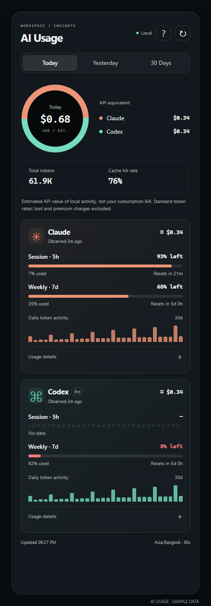
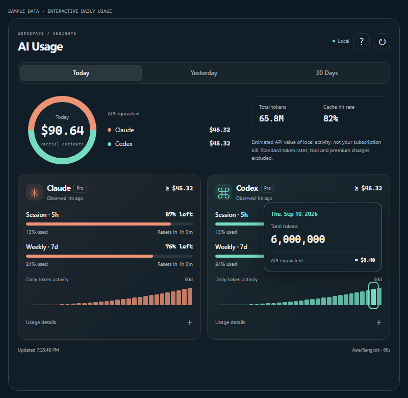
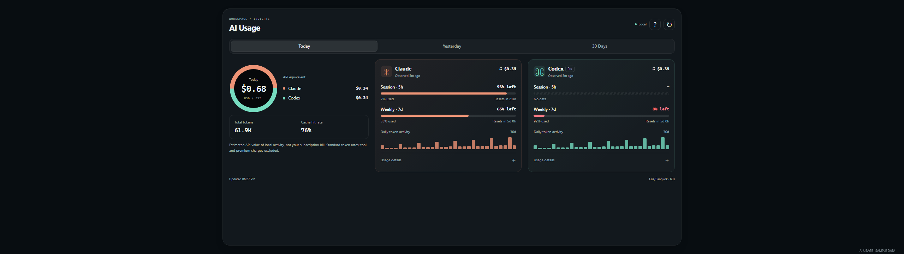
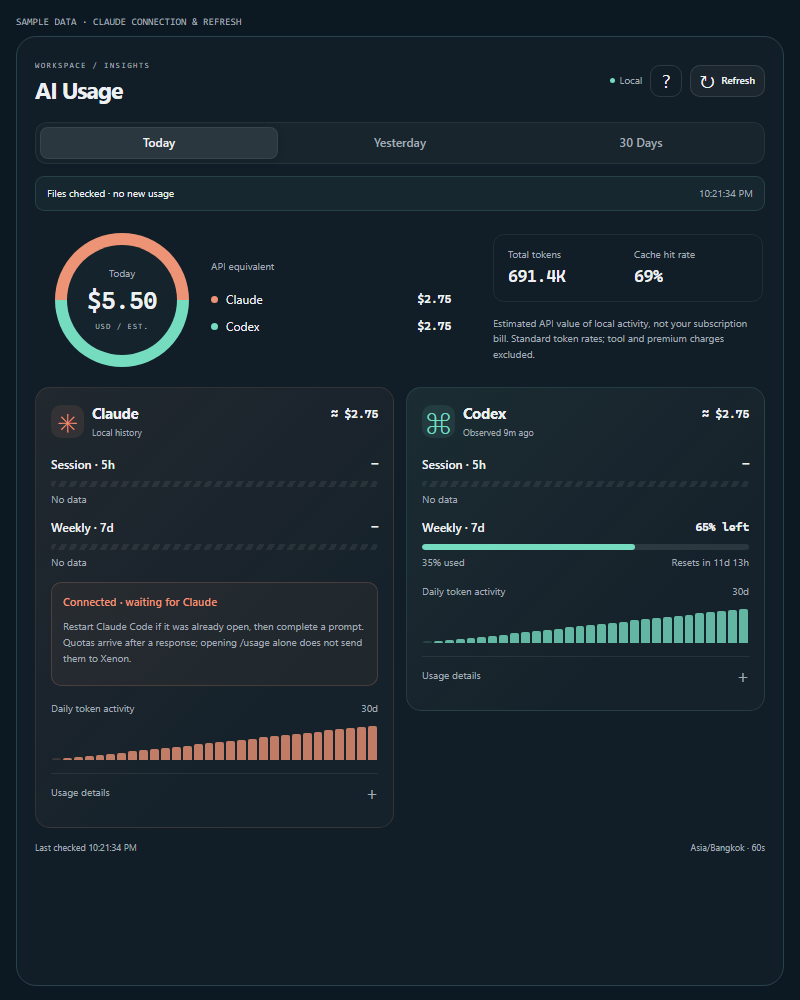
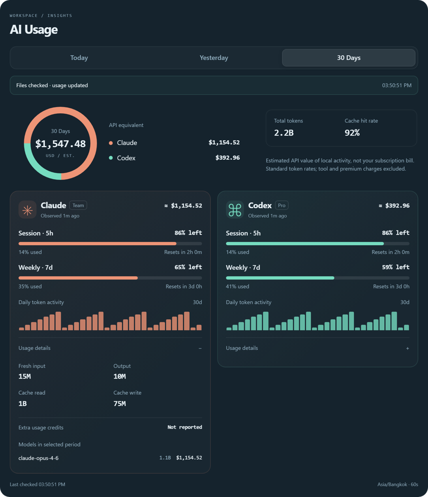
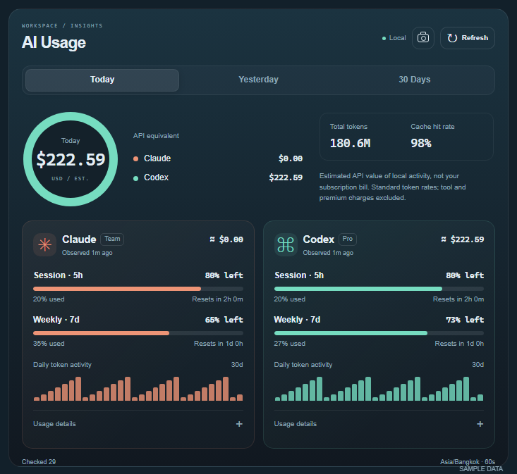
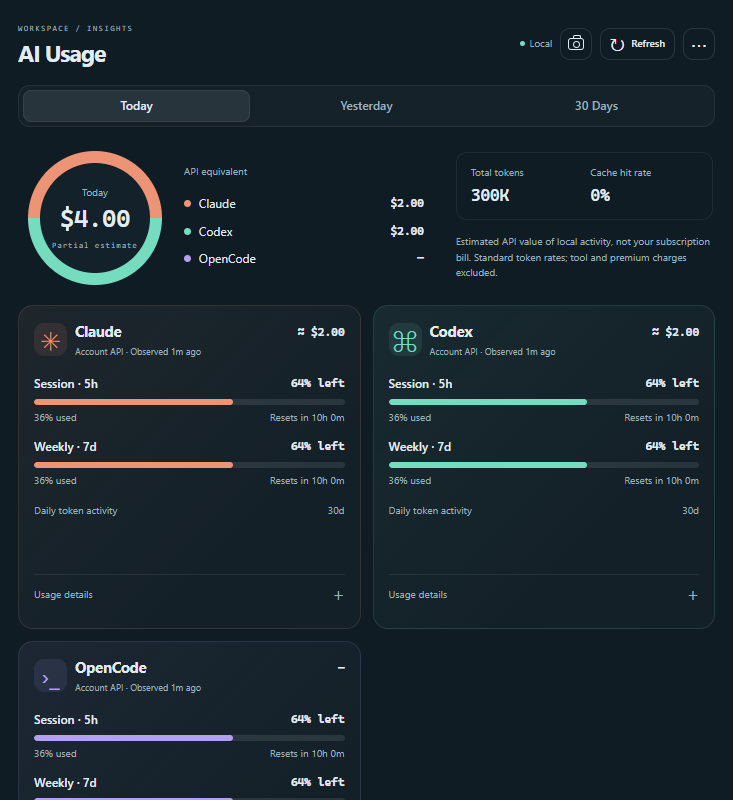
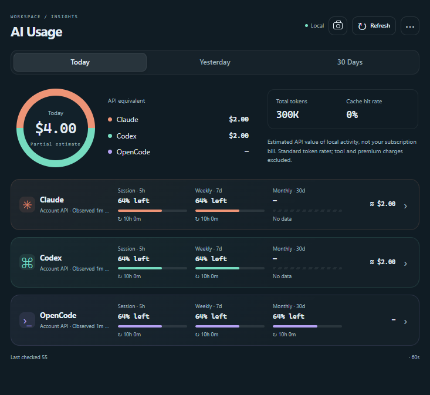

# AI Usage widget

Restart the Xenon backend after updating, reload the dashboard, then choose **+ → Productivity → AI Usage**. Resize or duplicate it using the existing dashboard layout controls.

### Running a release build from this checkout

The native `.exe` is the window around the dashboard. It loads the UI and APIs from the backend on port 3030; it does not embed `server/`. An upstream release executable can therefore display this widget when the backend runs from this checkout. Conversely, rebuilding the executable alone does not update a separately installed backend.

To build the local release executable, run `npm.cmd run build --workspace @xenon/native -- --no-bundle` from the repository root on Windows. The output is `apps/native/src-tauri/target/release/xenon-native.exe`. This produces a local executable without publishing an update or changing update verification.

Run `npm.cmd run dev` from this checkout to restart its backend, then close the existing Xenon app and open that executable. If Windows refuses to stop an older backend running as Administrator, run the restart command from an Administrator terminal. The usual upstream installer’s backend setup downloads the upstream source release, so use this checkout’s backend for local changes.

The widget combines Claude Code and Codex with Today, Yesterday, and 30 Days filters, an API-value breakdown, remaining subscription quotas, reset countdowns, 30-day token activity, and expandable model/cache details. Each copy keeps its own selected period and expanded sections while it remains mounted.

## Connect your usage

- **Codex:** use the signed-in Codex app or CLI on the same computer as the Xenon backend. Existing session telemetry is discovered automatically; no API key needs to be pasted into Xenon. Xenon checks the signed-in account API for current quotas and falls back to session telemetry.
- **Claude Code history:** run Claude Code locally. Xenon reuses its existing transcript reader.
- **Claude subscription quotas:** Xenon reads the account quota that Claude Code saves after `/usage` in `~/.claude.json` (`CLAUDE_CONFIG_DIR/.claude.json` with a custom config directory). This also works for Team accounts whose status line omits quotas. The cached account must match the current Claude account. The existing status-line bridge remains another source; Xenon uses the newer reading for each window. Xenon also checks the account API using the existing Claude Code login; open Claude Code to renew an expired login, then Refresh.

Click **Refresh** to rescan local usage immediately, including newly created session files. Manual refresh bypasses the 20-second aggregate cache and the one-minute file-discovery interval; concurrent requests share the same scan. The button shows when a refresh is running, and the last check time remains in the footer. The header no longer has a help button or refresh status strip. Failed requests show a warning and keep the previous reading visible. Automatic reads continue every 60 seconds while a widget is visible and may reuse recent cached history. Countdown text updates every 15 seconds. No telemetry scanning timer runs when this widget is absent.

Refresh reads local history plus the Claude and Codex subscription APIs. The backend reads existing Claude Code `.credentials.json` and Codex `auth.json` OAuth access tokens, honoring `CLAUDE_CONFIG_DIR` and `CODEX_HOME`. Tokens are sent only to their fixed HTTPS provider endpoint, never to the dashboard. Redirects are rejected. No refresh token is used or changed. The account cache is checked even when history is served from the aggregate cache. **Claude account cache · Observed … ago** identifies its source and retains Claude’s actual fetch time, so pressing Refresh never makes an old report look new. Missing, malformed, mismatched-account, or future-dated cache entries are ignored. The status-line-only fallback still depends on Claude supplying its [documented fields](https://code.claude.com/docs/en/statusline).

Click or tap a daily activity bar to see its date, exact token count, and estimated API value. Days without verified prices show an unavailable or partial estimate. Click the same bar again, click outside, or press **Escape** to dismiss. Keyboard users can Tab to the chart, press Enter or Space to open a day, and use Left/Right or Home/End to browse. Tooltips close when scrolling, resizing, or refreshing so a previous reading cannot linger over a changed chart. This frontend change only needs a dashboard reload when the backend already runs from this checkout.

## Copy an image

Click the camera button beside Refresh to copy the entire AI Usage widget as a PNG, then paste it into a chat. The image keeps the selected period and any expanded Usage details, includes content below the scroll area, and uses a solid theme background. It contains only this widget; no desktop or other widgets are captured. The button shows copying, success, or failure; success appears only after the clipboard write completes. Image copying requires clipboard access in the native app or a supported browser on localhost/HTTPS.

Long dollar totals shrink to fit inside the ring while retaining the full amount and cents. This UI update needs a dashboard reload, with no native rebuild.

## What the numbers mean

| Reading | Meaning |
| --- | --- |
| Today / Yesterday / 30 Days | Local calendar dates in the **server’s** time zone. Thirty days includes today. |
| API equivalent | Estimated USD value at the verified standard token rates in the code, **not subscription billing or actual charges**. Tool fees, fast-mode premiums, long-context premiums, and regional pricing are excluded. Claude cache writes use the five-minute cache rate. |
| Total tokens | Input plus output, with cached input counted once. Codex reasoning output is already part of output and is not added again. |
| Cache hit rate | Cache-read tokens divided by all input-side tokens. |
| Session / Weekly | Most recently reported account windows, classified by their reported duration. A weekly primary window is shown as Weekly. Changing the history filter does not change account quotas. |
| Other limits / Spark | Additional named Codex buckets, when reported, appear in Usage details. No bucket is fabricated. |
| Extra usage credits | Reported Codex credit balance or unlimited status. This is not interpreted as dollars. Claude extra-usage billing and plan details are not provided by the current bridge. |
| Older reading | Quota telemetry more than 15 minutes old. The last observation time remains visible. |
| Reset time passed | The previous quota has expired. The widget waits for a new reading instead of assuming a fresh 100% allowance. |
| Partial estimate | Some models have no verified rate or a file could not be read. Known costs and tokens remain visible; unavailable prices are not guessed. |

Activity is limited to local session logs: cloud tasks, website chats, another computer, deleted logs, or activity the client did not record may be absent. The first recorded cumulative Codex counter is attributed to its timestamp; older activity predating that record cannot be reconstructed. Live provider limits reflect the current file-based login; offline fallback reflects the most recently observed local account; this is not a multi-account billing tool.

## Sources and privacy

Claude history uses `~/.claude/projects` or `CLAUDE_CONFIG_DIR/projects`; Codex uses `CODEX_HOME` or `~/.codex`, under `sessions` and `archived_sessions`. The reader skips symlinks and only uses usage events and model context. The history reader never reads authentication files; the separate live-quota reader uses existing OAuth access tokens server-side. The `/api/ai-usage` response contains aggregates, model names, sanitized quota fields, connection state, and refresh metadata; prompts, tool output, credentials, and local paths are excluded. Xenon’s existing loopback, origin, and widget isolation checks remain in force.

Codex rate-limit fields follow the [official account rate-limit documentation](https://learn.chatgpt.com/docs/app-server#6-rate-limits-chatgpt). Standard price references were checked on 2026-09-11: [OpenAI pricing](https://developers.openai.com/api/docs/pricing), [GPT-5.5](https://developers.openai.com/api/docs/models/gpt-5.5), [GPT-5.4](https://developers.openai.com/api/docs/models/gpt-5.4), [GPT-5.3-Codex](https://developers.openai.com/api/docs/models/gpt-5.3-codex), and [Anthropic pricing](https://platform.claude.com/docs/en/about-claude/pricing). Prices are a maintained snapshot, not fetched on every refresh; historical activity uses this snapshot rather than date-specific billing rates.

## Verification

Focused Node tests cover cumulative usage deduplication, cache/reasoning accounting, counter resets, malformed values, unknown models, quota classification, partial file writes, rewritten/archived files, period filtering, shared scans, and response privacy. Existing widget-default, translation, and time-format checks cover dashboard integration.

The tooltip tests also cover exact daily values, empty days, unknown pricing, multiple widget copies, keyboard navigation, and dismissal. Browser checks verified mouse and touch selection on the first, middle, and last bars of both providers, Escape, keyboard navigation, and tooltip containment at 300×800, 440×1100, 800×780, 1920×1080, and 2560×720, including a chart scrolled to the tile's top edge. The expanded focused suite passed 33/33.

Browser checks exercised date filters, details surviving refresh, empty/error/expired states, and horizontal overflow at 300×800, 440×1100, 1920×1080, and 2560×720. Screenshots use explicitly labeled sample data; narrow tiles scroll vertically.

The real dashboard palette → widget → `/api/ai-usage` path also passed against an isolated Xenon backend using local usage data. The focused suite passed 28/28; JavaScript syntax checks, `git diff --check`, and `npm run demo:build` passed. The full suite passed 3,290 tests with 10 skips and six existing Windows-environment failures: PowerShell execution policy and source-extraction tests that assume LF line endings (stopwatch and update flows). The source-extraction failures were reproduced against the original source with this checkout’s CRLF endings.

Manual-refresh regression checks cover cache bypass, discovering new Claude/Codex sessions, concurrent scans, visible success/unchanged/cache/error states, and preserving all non-status-line Claude settings during usage-only linking. The connection endpoint uses the existing loopback and cross-site request guards.

The expanded refresh/connection suite passed 158 tests. Browser checks passed at 300×800, 440×1100, 800×1000, 1920×1080, and 2560×720. Live API checks confirmed automatic cache reuse and a new scan timestamp on every manual refresh. Claude’s quota connection was enabled with the other settings preserved; this earlier status-line-only check was superseded by the account-cache fix below.

The offline account-cache fix was verified against the actual local Team-account reading: session 0% used (100% left), weekly 35% used (65% left). Regression tests cover both cache schemas, zero usage, ISO reset timestamps, account matching, malformed input, cache refresh, source precedence, and response privacy.

The final actual-data browser check rendered 100% session remaining and 65% weekly remaining with no waiting message or horizontal overflow at 300×850, 440×1100, 1920×1080, and 2560×720. The quota observation time remained the original cache-fetch time. The focused cache/widget/translation/time-format suite passed 31/31.

Screenshot and clipboard verification covered 300×800, 440×1100, 830×620, 1920×1080, and 2560×720, plus million- and billion-dollar totals on narrow tiles. A minimized Chrome test copied the PNG and read it back; Windows Clipboard independently confirmed a 1572×1824 image with the expanded details below the viewport. Capture regressions verify pending/success/denial/unavailable/encoding-failure states, duplicate-click protection, and preservation of the selected period, details, and scroll position.

The help button and refresh status strip were removed. The existing 11 widget tests passed, including refresh progress, failure recovery, and image-copy feedback. Sample-data browser checks passed without horizontal overflow at 733×673, 440×1100, 1920×1080, and 2560×720; manual Refresh remained usable at every size. JavaScript syntax checks, `git diff --check`, and `npm run demo:build` passed.

## Live quota checks (OpenUsage reference)

The Claude and Codex quota protocol is based on the provider clients in [OpenUsage](https://github.com/robinebers/openusage), licensed under MIT; see [license attribution](licenses/openusage.txt). Xenon uses its own Node implementation and existing widget, without a Swift runtime or new dependencies.

Successful API readings are cached for five minutes. Manual Refresh bypasses that cache, with a ten-second duplicate-click guard. Concurrent requests share one fetch. Requests time out after eight seconds and response bodies are limited to 1 MiB. HTTP failures back off for five minutes; 429 responses honor longer Retry-After values, including during manual refresh. Failed refreshes retain the original observation time and display a warning. Claude uses the newest available reading for each window. Codex API responses include reported credits and additional model limits.

The Account API label identifies network-sourced limits. Local spending remains a separate API-equivalent estimate. An expired/rejected login requires opening or signing in through the provider app/CLI, then refreshing Xenon. Xenon deliberately does not rotate shared refresh tokens. File-based Claude Code and Codex logins are supported; macOS Keychain, encrypted Desktop-only logins, multi-account Swap profiles are outside this integration; OpenCode Go support is described below.

## Dynamic layout and OpenCode Go

Use **⋯ → Layout** on each AI Usage widget: **Auto**, **Grid · 1/2/3/4 per row**, or **List · horizontal rows**. Grid counts are a maximum: cards drop to fewer columns when the tile is too narrow. List places the provider identity beside its quota meters on wider tiles and stacks them on narrow tiles. Auto fits up to four columns. Layout is saved locally per widget instance, including duplicated widgets, and restored after reload on that browser/device. Other devices keep their own layout.

The widget accepts Claude, Codex and OpenCode cards and calculates the ring from each provider's actual cost share. No placeholder provider or quota is added.

OpenCode Go follows OpenUsage's `OpenCodeAuthStore`, `OpenCodeUsageClient` and `OpenCodeUsageMapper`: read only the `opencode-go.key` entry in the local `auth.json` and request `https://opencode.ai/zen/go/v1/usage`. Data directory precedence is `OPENCODE_DATA_DIR`, `XDG_DATA_HOME/opencode`, then `~/.local/share/opencode`. The card appears when a Go credential is found, including when its API request fails, so the warning remains visible. Other OpenCode provider credentials are never sent to this endpoint.

Session, Weekly and Monthly use reported percentages and reset times. The same cache, request sharing, timeout, redirect protection and backoff apply to all three providers. This integration does not yet import OpenCode SQLite history or Zen spending: its cost displays an em dash, no token chart is fabricated, and the combined estimate is marked partial. It does not double-count OpenCode traffic using an existing Claude/Codex account.

Regression coverage verifies three-provider rendering, per-instance layout persistence, storage failures, Go credential isolation and all three quota windows. Browser checks cover six layouts at 300×800, 440×1100, 733×673, 1920×1080 and 2560×720, plus reload persistence.

### Compact List

List now shows the provider, session/weekly/monthly meters, reset countdowns and estimated cost in one expandable row. Click or use Enter/Space on a row to open history and model details. Expansion survives refresh while mounted. All layouts retain the full overview: the cost ring, provider breakdown, total tokens and cache hit rate. Only the provider rows become compact in List. Missing windows remain unavailable and API warnings have a visible indicator with the full warning inside the expanded row. Narrow tiles place the meters below the identity.

