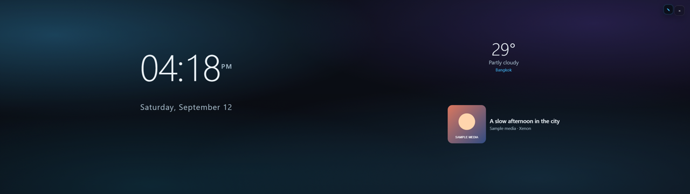
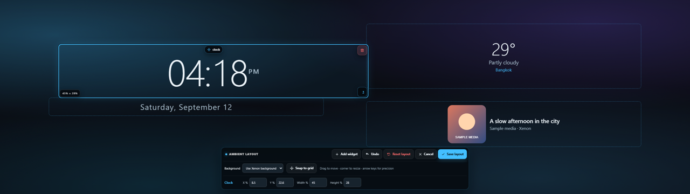

# Ambient layout editor

Custom Ambient layouts use the Xenon background by default, including Prisma, wallpapers, and video backgrounds. The background setting is saved with the layout. Installed scenes with their own background keep it until you choose **Use Xenon background**.

*Preview with sample weather and media data.*

## Arrange your screen

1. Open Ambient and choose **Edit layout**.
2. Drag a widget to move it; drag its lower-right corner to resize it. Movement is free by default. Enable **Snap to grid** for alignment, or hold Alt to bypass snapping temporarily.
3. Select a widget to enter exact **X**, **Y**, **Width**, or **Height** percentages in the toolbar. Arrow keys move the selected widget; Delete removes it.
4. Choose **Background → Use Xenon background** to restore your dashboard backdrop, or **Use scene background** to show the layout's own background.
5. Choose **Save layout** to keep the changes. **Undo** reverses the last edit; **Cancel** restores the layout from before editing.

Drag the toolbar by its title if it covers a widget. The toolbar fits narrow screens and returns to its default position when the window is resized. Imported layouts are copied before editing.

Clock text and media artwork fit the widget's width and height, including short ultrawide displays. Saved positions retain two decimal places so releasing a drag does not jump to a whole percentage.

## Verification

Checked mouse and touch dragging, resizing, toolbar movement, background switching, numeric fields, Undo, Cancel, and save/reload in Chrome. Layouts were checked at 300×850, 440×1100, 800×600, 1920×1080, and 2560×720 without horizontal toolbar overflow.

Geometry edits preserve live widget DOM and SDK frames. The Ambient renderer reads changing clock, weather, and media values once per second and stops while hidden or unmounted. Background animations retain their own animation lifecycle.
