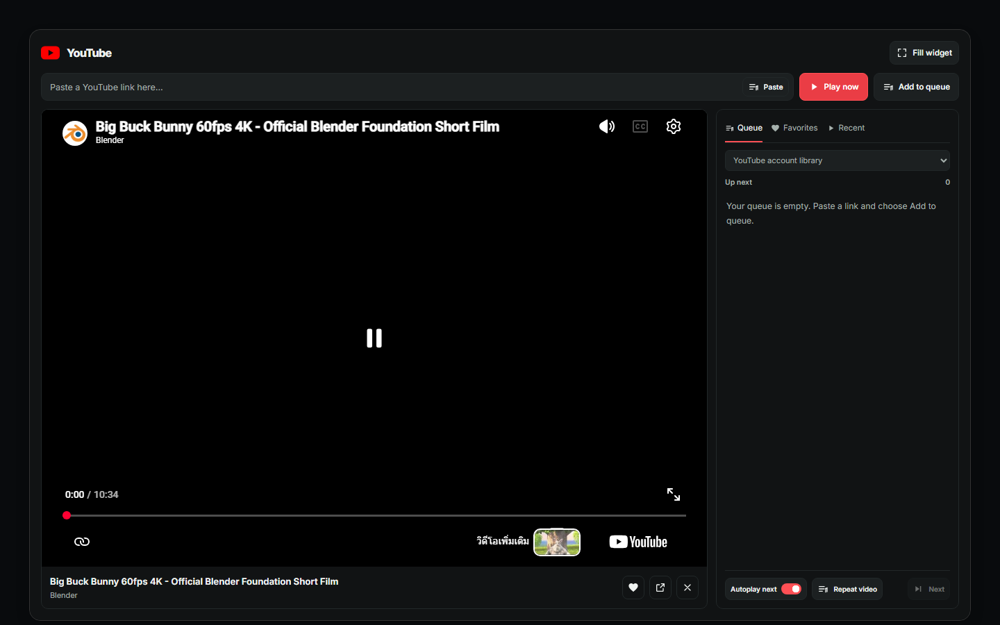
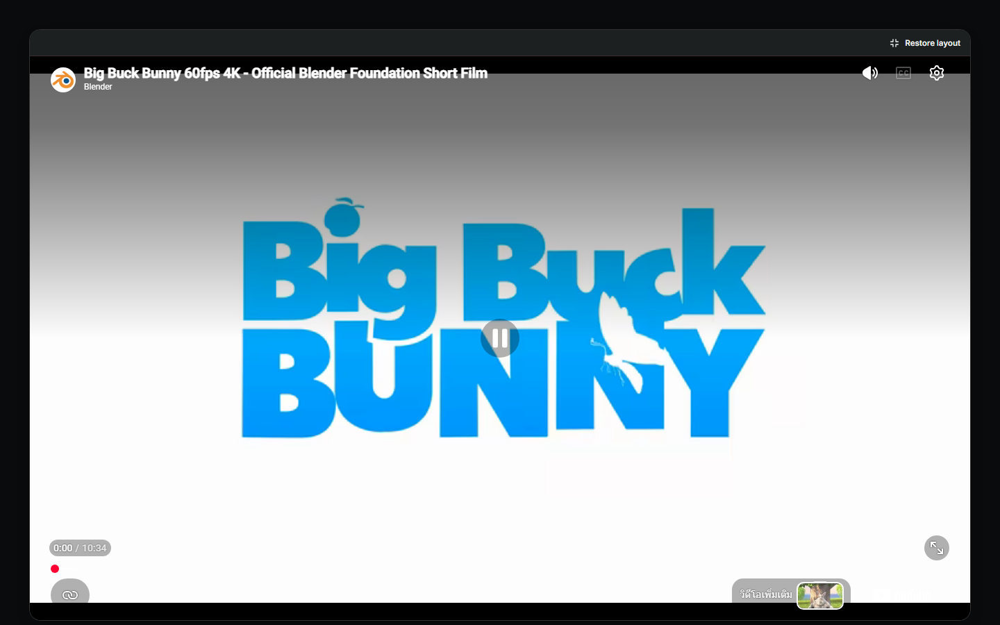

# YouTube player

Add **YouTube** from the dashboard’s **+** widget picker. Paste a video link and
choose **Play now** or **Add to queue**. An account connection is not required
for pasted links, the queue, favorites, or recent videos.

Watch links, `youtu.be` links, Shorts, live-video links, embedded-video links, and
video IDs are accepted. A link’s `t` or `start` position is honored. A playlist-only
link does not identify a video; use the connected account’s playlist browser instead.

The video uses YouTube’s own play/pause, seek, volume, captions, quality and speed
controls where YouTube makes them available. There is no second playback toolbar
below it and no overlay intercepting touches on a working embed.

- **Fill widget** hides the link field, library and video details while keeping the
  same iframe mounted. **Restore layout** returns without restarting playback.
  Escape also returns when keyboard focus is on the dashboard; events inside the
  cross-origin YouTube player belong to YouTube, so the restore button remains visible.
- In a browser, YouTube’s fullscreen button opens the video fullscreen.
- In the native app, the separate **Full screen** button fills the dashboard
  window while preserving its kiosk/window state. Browser fullscreen remains
  disabled inside the native embed because exiting it previously broke kiosk state.
- **Queue** shows upcoming videos. **Next** starts the next video; **Autoplay next**
  advances when the current video ends. **Repeat video** takes priority over autoplay.
  Each upcoming item can be removed. Closing the player clears the current queue.
- The heart saves or removes the current video in **Favorites**. **Recent** records
  videos opened here. These lists, autoplay and repeat preferences are stored in this
  browser, not synced across devices. Favorites are limited to 100 and recent videos
  to 30; the current session queue is limited to 100 entries. Reloading does not autoplay.
- **YouTube account library** retains liked videos, playlists, subscriptions and
  search. Connect the account under **Settings → Streaming** to use these features.

Titles and channel names update when the embedded player reports them. Until then,
an unsourced title is shown as a video ID. Videos that cannot be embedded offer
**Open in the browser**. A player configuration error is distinguished from a
video whose owner disallows embedding.

The existing Player and Library sections can still be hidden or reordered through
Edit Layout. A hidden Player section must be shown before playing a pasted link.

Validation covers URL and saved-data boundaries, origin/source checks, queue advance,
repeat/autoplay, storage failure, and the native fullscreen guard. Browser checks
cover signed-out playback, persisted favorites, iframe identity during fill/restore,
and desktop, 2560 × 720 Edge, portrait and phone layouts. Live Chromium playback was
verified using the Blender Foundation’s Big Buck Bunny video. Native window behavior
still requires a platform smoke test; its existing fullscreen guard is retained.
